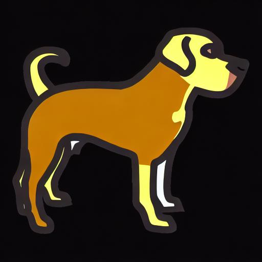
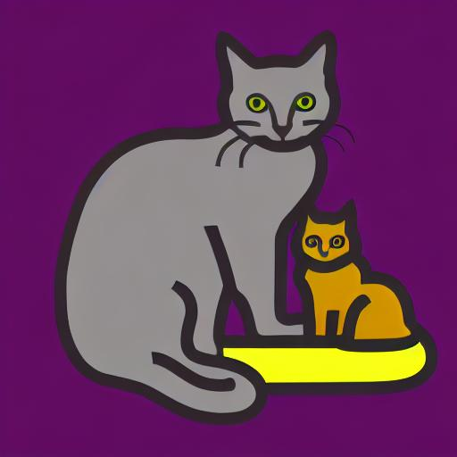
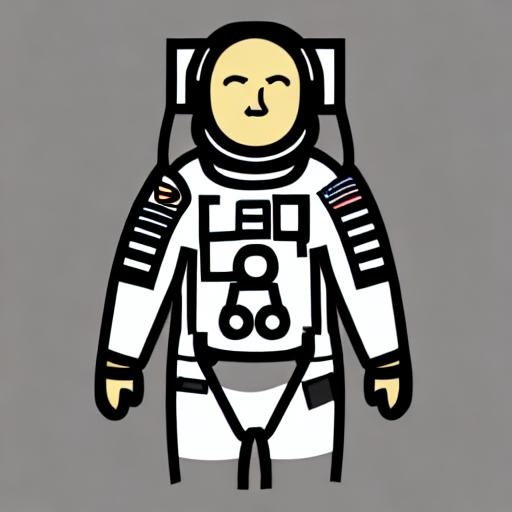
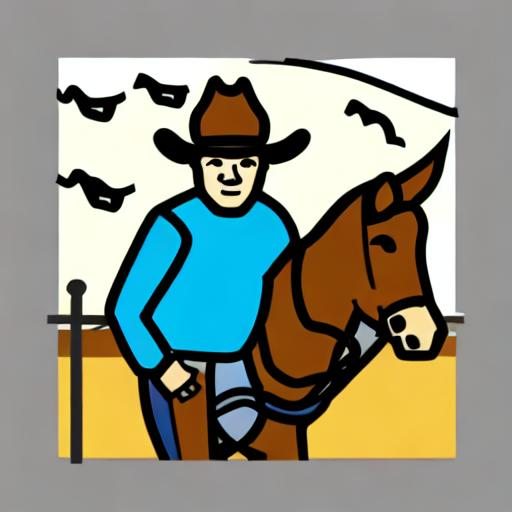

# GenerativeAAC

My approach to training a stable diffusion model to generate AAC icons

</img>
</img>
</img>
</img>

Prompts used to generate the above images:
* AAC symbol of a dog
* AAC symbol of a cat
* AAC symbol of an astronaut
* AAC symbol of a cowboy

## Model Information
This model is a Stable Diffusion model that was fine-tuned on AAC symbol data from the Mulberry dataset. It captures the style of AAC symbols, but maintains some of the downfalls of diffusion models, such as its lack of ability to generate text within the images.

It is hosted on HuggingFace in a private repository.

## Contributors

Jeremy Cavallo | jjcavallo@wayne.edu | [Website](https://www.jeremycavallo.com)
